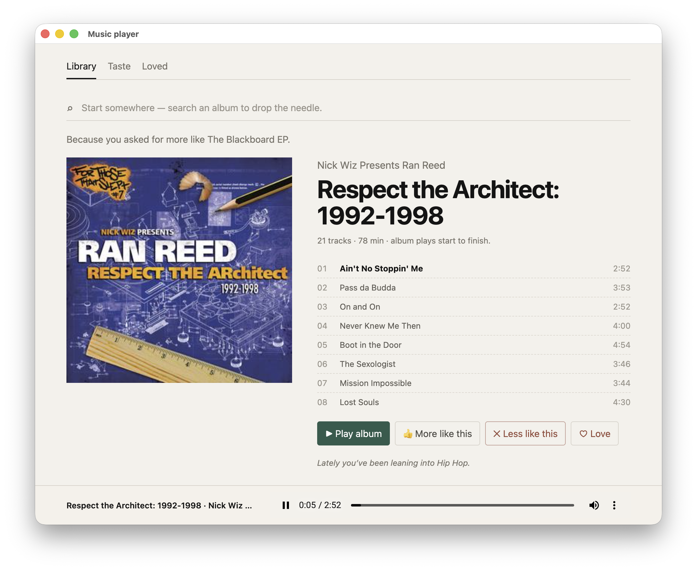

# Galileo

Galileo is a music player to rediscover your music library. It relies on CLAP analysis of all your songs, and then uses that information to rediscover albums.

The twist of this music player is that it does not allow you to listen to songs, but rather entire albums. You can browse through your library like a dating app: like or dislike an album, and the next suggestion will be similar to whatever you are liking at that moment.

## Features

 - Listen to only full albums
 - "Love" an album to build up a list of albums you enjoyed and want to revisit.
 - Suggestions based on the previously listened albums, or liked/disliked
   albums.
